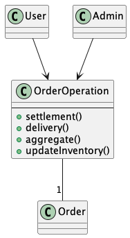

## 課題1

1. 単一責任原則 (SRP: Single Responsibility Principle)
クラスやモジュールは1つの責務にのみ責任を持つべきであるという原則。

注文システムを開発するとし、注文管理クラスがあるとする。
そのクラス内では決済メソッド、配送メソッド、集計メソッド、在庫更新メソッドを実装している場合、決済処理に仕様変更が起きたり、または配送処理に仕様変更が起きる場合に他の機能に影響を与える可能性がある。
それぞれの機能に影響を与えないために、機能ごとで独立したクラスを実装し、他の実装に交換できる単位としておく方が保守性がよくなる。

Before



After


クラスの責務は将来の保守開発を意識して考える必要がある。

2. 開放閉鎖原則 (OCP: Open Close Principle)
クラスの設計は拡張に対してオープンな姿勢をとり、変更に対してクローズドであるべきであるという原則。
機能追加には柔軟に対応したいが、既存機能には影響しないように実装するべきである。

例えばFizzBuzz問題と例とする。
仕様変更の内容として、3,5,15の他に偶数で特定のテキストを表示するなどが考えられる。

下記のようなハードコードだと機能追加の度に、考慮する箇所が増えてしまう。

````php
if ($n % 15 === 0) {

} else if ($n % 3 === 0) {

} else if ($n % 5 === 0) {

} else {

}
````

これらを解決するために、仕様を抽象化した設計をして保守性を向上させることが大事になる。

3. リスコフの置換原則 (LSP: Liskov Substitution Principle)
派生クラスの振る舞いは基底クラスの振る舞いを完全にカバーしなければならないという原則。
例えば、TODOアプリでタスクの合計件数と残タスク数を表示するクラス(TaskDisplayClass)があるとする。
そこに機能追加で消化率を表示するという要件が発生して、下記のように改修したとする。


````php
class TaskDisplay
{
  public function show(): string
  {
    return "全${$this->total}件中、 ${$this->remains}件が完了しました。";
  }
}

class PercentTaskDisplay extends TaskDisplay
{
  public function show():string
  {
    $percent = (int)(100.0 * $this->remains / $this->total); // これだと0除算が発生！！
    return parent::show() . "($percent %)"
  }
}
````

しかし、これだと0除算が発生しエラーが出力される。
その際に基底クラスの`total`に0を入れない修正をしてしまうと本来の基底クラスの振る舞いを変更してはいけない。他に基底クラスを参照している部分に影響を与えてしまう。

4. インターフェース分離原則 (ISP: Interface Separation Principle)
インターフェース版の単一責任原則である。
メリットとしては、
- 呼び出し側からは不必要なメソッドが見えないため、使い方が簡単になる。
- 呼び出されるメソッドを限定できるため、問題分析が簡単になる。
- 別のクラスで代替が簡単になる。

Before


After


5. 依存関係逆転原則 (DIP: Dependency Inversion Principle)
従来、上位層のクラスが下位層のクラスを呼び出す構造になっていたが、下位層のクラスで実装が変更されると上位層クラスにも影響を与えてしまう問題が発生し保守性が低下していた。
それらの解決策として、依存関係を逆転させることによって、上位層クラスと下位層クラスを分離し、上位層クラスが下位層クラスに依存しないようにするようにする。その代わりに下位層クラスは実装を抽象化したインターフェースを提供し、上位層クラスはこのインターフェースに依存することで保守性が向上する。

